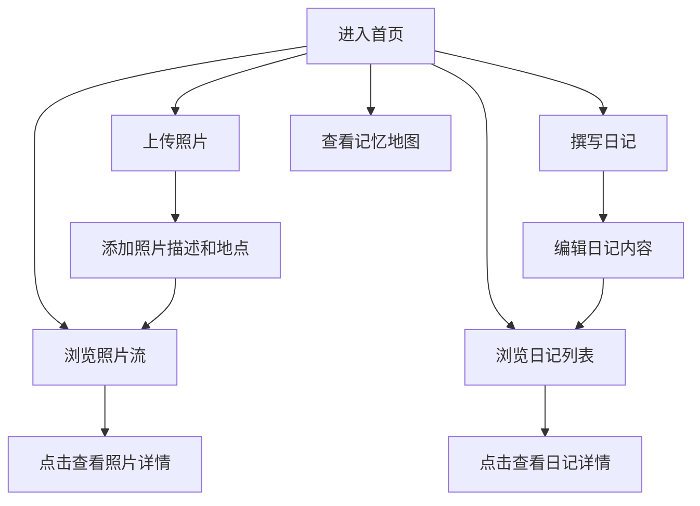

## 1. Product Overview
一个温馨的生日纪念网站，专为热爱旅游和拍照的朋友打造。用户可以上传旅行照片、撰写日记，记录生活中的美好瞬间，形成个人的记忆地图。

## 2. Core Features

### 2.1 User Roles
| Role | Registration Method | Core Permissions |
|------|---------------------|------------------|
| 用户 | 无需注册（本地存储） | 浏览、上传照片、撰写日记 |

### 2.2 Feature Module
1. **首页**: 照片瀑布流展示、日记列表、导航栏
2. **相册页**: 照片网格展示、上传功能、照片详情
3. **日记页**: 日记列表、撰写日记、日记详情
4. **记忆地图**: 照片按时间/地点组织的可视化展示

### 2.3 Page Details
| Page Name | Module Name | Feature description |
|-----------|-------------|---------------------|
| 首页 | Hero区域 | 生日祝福横幅、欢迎语 |
| 首页 | 照片流 | 瀑布流展示最新照片 |
| 首页 | 日记预览 | 最新日记卡片预览 |
| 相册页 | 照片网格 | 网格布局展示所有照片 |
| 相册页 | 上传功能 | 支持拖拽上传照片 |
| 相册页 | 照片详情 | 点击查看大图和描述 |
| 日记页 | 日记列表 | 按时间倒序展示日记 |
| 日记页 | 撰写日记 | 富文本编辑日记内容 |
| 记忆地图 | 时间线 | 按时间顺序展示记忆 |

## 3. Core Process

用户进入网站 → 浏览首页照片和日记 → 上传新照片/撰写日记 → 查看记忆地图回顾

## 4. User Interface Design

### 4.1 Design Style
- **主色调**: 温暖的粉色(#FFB6C1)和金色(#FFD700)，营造生日派对的温馨氛围
- **辅助色**: 浅紫色(#E6E6FA)作为背景点缀
- **按钮风格**: 圆角设计，hover时有柔和的缩放动画
- **字体**: 标题使用圆润可爱的字体，正文使用清晰易读的字体
- **布局**: 卡片式设计，配合瀑布流和网格布局
- **图标**: 使用可爱的emoji和简洁的图标

### 4.2 Page Design Overview
| Page Name | Module Name | UI Elements |
|-----------|-------------|-------------|
| 首页 | Hero区域 | 渐变背景、生日蛋糕装饰、欢迎文字动画 |
| 首页 | 照片流 | 瀑布流布局、圆角卡片、hover放大效果 |
| 首页 | 日记预览 | 卡片式、日期标签、摘要预览 |
| 相册页 | 照片网格 | 响应式网格、拖拽上传区域、筛选功能 |
| 日记页 | 日记列表 | 时间线样式、卡片阴影、阅读按钮 |
| 记忆地图 | 时间线 | 垂直时间轴、照片标记、节点动画 |

### 4.3 Responsiveness
- 桌面端: 多列网格布局
- 平板端: 自适应列数
- 移动端: 单列布局，底部导航

### 4.4 Design Details
- 生日主题装饰元素（气球、彩带、蛋糕）
- 平滑的页面过渡动画
- 照片hover时显示爱心点赞效果
- 日记卡片带有柔和阴影和圆角
