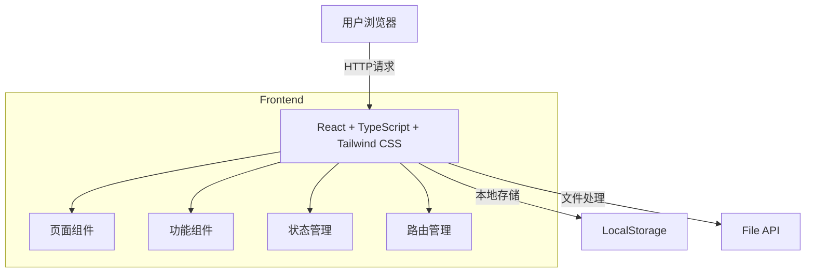
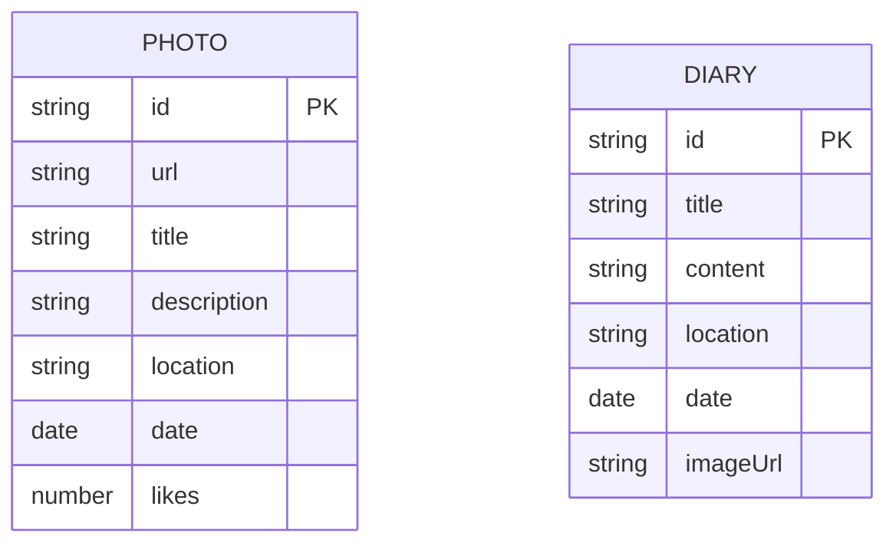

## 1. Architecture Design



## 2. Technology Description
- **Frontend**: React@18 + TypeScript + Tailwind CSS@3 + Vite
- **Initialization Tool**: vite-init
- **Backend**: None (纯前端应用，使用LocalStorage存储数据)
- **State Management**: Zustand
- **Routing**: React Router DOM
- **Icons**: Lucide React

## 3. Route Definitions
| Route | Purpose |
|-------|---------|
| / | 首页，展示照片流和日记预览 |
| /photos | 相册页，照片网格展示和上传 |
| /diary | 日记页，日记列表和撰写 |
| /timeline | 记忆地图，时间线展示 |
| /photo/:id | 照片详情页 |
| /diary/:id | 日记详情页 |

## 4. API Definitions
无需后端API，所有数据存储在LocalStorage中

## 5. Server Architecture Diagram
纯前端应用，无后端服务器

## 6. Data Model

### 6.1 Data Model Definition



### 6.2 Data Definition Language

**Photo 接口**:
```typescript
interface Photo {
  id: string;
  url: string;
  title: string;
  description: string;
  location: string;
  date: string;
  likes: number;
}
```

**Diary 接口**:
```typescript
interface Diary {
  id: string;
  title: string;
  content: string;
  location: string;
  date: string;
  imageUrl: string;
}
```

### 6.3 LocalStorage Key Structure
- `birthday_photos`: 存储照片数组
- `birthday_diaries`: 存储日记数组

### 6.4 Initial Mock Data
预置一些示例照片和日记数据，展示网站功能
